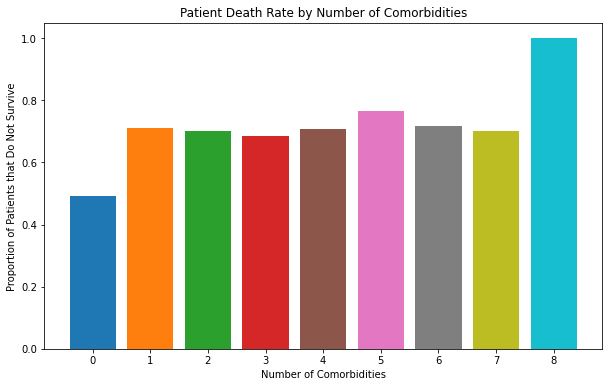
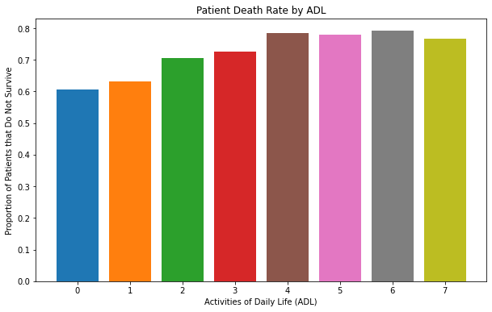
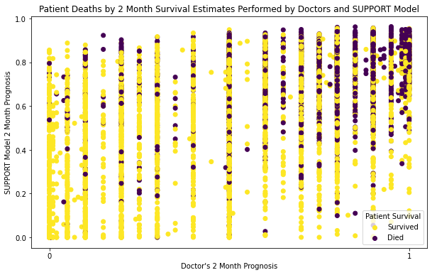
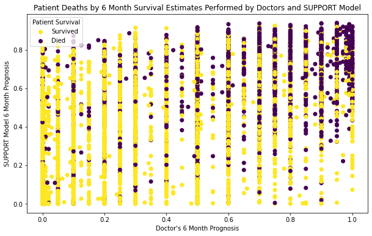

## Predicting Survival for Patients with Severe Illness

I applied machine learning techniques clinical data from patients with severe illnesses to predict whether or not they will pass away in the next 6 months. 

## Introduction 

For patients with severe illness, one of the major decisions that individuals, healthcare workers, loved ones may have to make is whether or not to prolong the care they are recieving, especially for those on life-support. According to a report by KFF, about 71% of people in the U.S. believe that helping people die without pain, stress, and discomfort is more important than prolonging someone's life as much as possible [^1]. Furthermore, the SUPPORT Principal Investigators ran a controlled trial to observe and document aspects of hospital deaths. They found that "for 50% of conscious patients who died in the hospital, family members reported moderate to severe pain at least half the time" and "only 47% of physicians knew when their patients preferred to avoid CPR". This study also found no improvement to communication between patients and physicians despite an intervention that included a specialized nurse to contact the patient and family.[^2] Therefore, being able to predict survival for patients who need end-of-life care can help those around them make informed decisions about their care, such as whether or not to continue life-support, sign a Do Not Resuscitate (DNR) form, or start hospice care.

This project uses a Linear Support Vector Classifier (LinearSVC) on the data collected by the SUPPORT Principal Investigators, which includes information about the patients' type of disease, age, vital signs, and other information, to predict whether or not a patient will pass away within the next six months. We then compared the accuracy of my model to the accuracy of LinearSVCs that only used combinations of the SUPPORT Model (as developed by the SUPPORT Principal Investiagors) and doctor's prognoses for six month survival. We concluded that we got the best results from the LinearSVC that used as many featurs as possible and that the SUPPORT Model was slightly more accurate than just doctors' prognoses.

## Data and Preprocessing

That data used in this project is from the UCI Machine Learning Repository. It was originally collected from 1989-1994, however, it was only put on the UCI Machine Learning Repository in late 2023. The dataset contains information about patients' age, race, sex, disease type, vital signs, if/when they signed a DNR, presence of other diseases such as diabetes, dementia, or cancer, etc (See [^3] for a comprehensive description of each of the 48 total features). The target feature is 'death', which is a 1 if the patient passed away within 180 days following the study, or 0 if they survived.

To pre-process this data, first I filled in some missing values with the [suggested values](https://archive.ics.uci.edu/dataset/880/support2#:~:text=Baseline%20Variable%09Normal%20Fill%2Din%20Value%0A%2D%20Serum%20albumin%20(alb)%093.5%0A%2D%20PaO2/FiO2%20ratio%20(pafi)%20%09333.3%0A%2D%20Bilirubin%20(bili)%091.01%0A%2D%20Creatinine%20(crea)%091.01%0A%2D%20bun%096.51%0A%2D%20White%20blood%20count%20(wblc)%099%20(thousands)%0A%2D%20Urine%20output%20(urine)%092502) [^3].

```python
#these are vital statistcs
df=df.fillna({'alb':3.5,'pafi':333.3,'bili':1.01,'crea':1.01,'bun':6.51,'wblc':9,'urine':2502})
```
Next, I dropped the columns for the target data we are not looking to model, as well as columns that had a significant number of missing values or shouldn't directly affect a patient's survival rate.

```python
#drop columns with not enough data
df=df.drop(columns=['adlp', 'adls', 'edu', 'income','glucose','ph','totcst','totmcst'])
#in order these columns represent: activity level as reported by the patient
                                   activity level as reported by family/others
                                   years of education
                                   glucose level
                                   blood ph level
                                   total cost of hospital stay
                                   total cost estimate (micro cost)

#drop columns that don't (intuitively) directly affect survival rates
df=df.drop(columns=['dzclass'])

#'dzclass' is the generalization of 'dzgroup' (the type of disease), so it is repeat data
```

Finally, since many of the columns were categorical data, I used the pandas method `pd.get_dummies(df)` to convert categorical data into numerical data. When we convert the data, we also make sure to drop the first column to avoid multicolinearity[^4]

```python
df=pd.get_dummies(df,drop_first=True)
```
## Initial Observations
To get a better idea of if this dataset would work for a machine learning model, I made some plots to examine the relationship between a few of the features and the target (predicting patient survival):

The description for this dataset notes that daily activity level and low number of comorbidites(other diseases also present in the patient) are correlated with higher survival rates. To investigate this, I made some plots to compare the proportion of patients that do not survive by their activity level or number of comorbidities.


*Figure 1: Each column represents a number of comorbidites and the value of the column represents the proportion of people with that number of comorbidities that died within 6 months of the conclusion of the study.*

Notice that of the patients with 0 comorbidities, about 49% of them died within 6 months. However, the rates of death for the other numbers of comorbidities were fairly similar, albeit higher. This suggests that having any comorbidities makes you more likely to pass away soon. Both of the people who had 8 comorbidities died, so the rate of death for patients with 8 comorbidities is 100%. This matches our expectation that patients with more comorbidities do not survive as long.

The next graph compares the rates of death based on Actvities of Daily Life.


*Figure 2: Each column represents a range of ADL corresponding to the value on the x axis. Higher ADL suggests a more active lifestyle.The value of the column represents the proportion of people in that range of ADL that died within 6 months of the conclusion of the study.*


*Figure 3: Each column represents a range of ADL corresponding to the value on the x axis. Higher ADL suggests a more active lifestyle.The value of the column represents the total number of people in that range of ADL that died within 6 months of the conclusion of the study.*

In Figure 2, we notice that it seems like more active people are less likely to survive. This is counter-intuitive because we expect that more active people would be on average healthier. I believe that this discrepancy is because people who are more active are less likely to have a severe illness in the first place, which means that they wouldn't even be included in the study. This is supported by how few patients there are with high ADL (Figure 3). Therefore, those that have a higher ADL might be more likely to die within 6 months because their illnesses have to be worse to affect them to the same degree as their peers who have less active lifestyles.

Finally, I compared the 2 month and 6 month estimates from doctors and the SUPPORT model to the target. The 


*Figure 4: Doctor and SUPPORT model probabilities for survival after 2 months compared with whether or not the patient survived after 6 months.*


*Figure 5: Doctor and SUPPORT model probabilities for survival after 6 months compared with whether or not the patient survived after 6 months.*


Here is an overview of the dataset, how it was obtained and the preprocessing steps taken, with some plots!


*Figure 1: Here is a caption for my diagram. This one shows a pengiun [1].*

## Modelling


Here are some more details about the machine learning approach, and why this was deemed appropriate for the dataset. 

The model might involve optimizing some quantity. You can include snippets of code if it is helpful to explain things.

```python
from sklearn.ensemble import ExtraTreesClassifier
from sklearn.datasets import make_classification
X, y = make_classification(n_features=4, random_state=0)
clf = ExtraTreesClassifier(n_estimators=100, random_state=0)
clf.fit(X, y)
clf.predict([[0, 0, 0, 0]])
```

This is how the method was developed.

## Results

Figure X shows... [description of Figure X].

## Discussion

From Figure X, one can see that... [interpretation of Figure X].

## Conclusion

Here is a brief summary. From this work, the following conclusions can be made:
* first conclusion
* second conclusion

Here is how this work could be developed further in a future project.

## References

[^1]: [B. Wu, “Views and Experiences with End-of-Life Medical Care in the U.S.,” KFF, Apr. 27, 2017. https://www.kff.org/report-section/views-and-experiences-with-end-of-life-medical-care-in-the-us-findings/](https://www.kff.org/report-section/views-and-experiences-with-end-of-life-medical-care-in-the-us-findings/)

[^2]: [A. F. Connors, et.al, “A Controlled Trial to Improve Care for Seriously III Hospitalized Patients,” JAMA, vol. 274, no. 20, p. 1591, Nov. 1995, doi: https://doi.org/10.1001/jama.1995.03530200027032.] (https://jamanetwork.com/journals/jama/article-abstract/391724)

[^3]: [F. Harrel, “SUPPORT2,” UCI Machine Learning Repository, Sep. 14, 2023. https://archive.ics.uci.edu/dataset/880/support2](https://archive.ics.uci.edu/dataset/880/support2)
[^4]: [SandhyaKrishnan02, “Multicollinearity, how to handle it to avoid dummy variable trap?,” www.kaggle.com, Jan. 2021. https://www.kaggle.com/discussions/general/294096](https://www.kaggle.com/discussions/general/294096)
[back](./)

